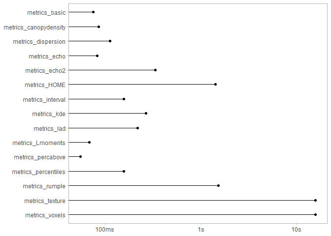

<!-- README.md is generated from README.Rmd. Please edit that file -->

# lidRmetrics

Additional point cloud metrics for use with \*\_metric functions in the
`lidR` package.

The package serves as a companion to the `lidR` package and offers a
variety of functions for calculating different types of point cloud
metrics. These include `metrics_basic()` for basic information about the
point cloud, `metrics_percentiles()` for height percentiles,
`metrics_percabove()` and `metrics_dispersion()` for characterizing the
vertical structure. Additionally, `metrics_echo()` and `metrics_echo2()`
provide information on the number and proportion of different return
types, while `metrics_interval()` calculates the percentage of points by
horizontal layers. More complex metrics such as `metrics_kde` and
`metrics_voxels()` are also included. A comprehensive list of metrics
and their corresponding functions can be found in the table below.

These individual functions serve as building blocks that can be combined
to create various sets of metrics. The package includes three examples
of such metric sets.

## Installation

You can install the most recent version of the package by executing the
code below:

``` r
devtools::install_github("ptompalski/lidRmetrics")
library(lidRmetrics)
```

## Example usage

All of the functions in `lidRmetrics` are designed to be used with one
of the \*\_metrics functions in the `lidR` package
(e.g. `pixel_metrics()`).

For example:

``` r
library(lidR)
library(lidRmetrics)

LASfile <- system.file("extdata", "Megaplot.laz", package="lidR")
las <- readLAS(LASfile, select = "*", filter = "-keep_random_fraction 0.5")

m1 <- cloud_metrics(las, ~metrics_basic(Z))

m2 <- pixel_metrics(las, ~metrics_set1(Z), res = 20)

m3 <- pixel_metrics(las, ~metrics_set2(X, Y, Z), res = 20)
```

## List of metrics

#### Simple descriptive statistics - `metrics_basic()`

- `n` - total number of returns
- `zmin`, `zmax`, `zmean`, `zvar`, `zsd`, `zcv`, `zskew`, `zkurt` -
  elevation maximum, minimum, mean, standard deviation, coefficient of
  variation, skewness, and kurtosis

#### Height percentiles - `metrics_percentiles()`

- `zq1`
- `zq5`
- `zq10`
- `…`,
- `zq90`,
- `zq95`,
- `zq99`

#### Proportion of returns above threshold height - `metrics_percabove()`

Proportion of returns above a user-defined threshold. By default,
percent of returns above mean elevation, above 2 and 5 m are calculated.

- `pzabovemean`
- `pzabove2`
- `pzabove5`
- `pzabove*`

#### Vertical structure - `metrics_dispersion()`

- `ziqr` - interquartile distance
- `zMADmean`, `zMADmedian` - mean absolute deviation (MAD) from the mean
  and the median
- `CRR` - canopy relief ratio ((mean - min) / (max – min))
- `zentropy`, `VCI` - normalized Shannon diversity index, Vertical
  Complexity Index

see: van Ewijk, K. Y., Treitz, P. M., & Scott, N. A. (2011).
Characterizing Forest Succession in Central Ontario using LAS-derived
Indices. Photogrammetric Engineering and Remote Sensing, 77(3), 261-269

#### Cumulative point density - `metrics_canopydensity()`

Canopy density metrics as defined by Woods et al. 2008. Elevation range
is divided into 10 equal intervals, and the cumulative proportion of
returns in each interval is calculated. For example, zpcum3 is a
cumulative percentage of returns located in lower 30% of maximum
elevation. The results for the last (topmost) layer is not reported as
it always equal to 100%. The number of layers (default = 10) can be
specified by the user.

- `zpcum1`
- `zpcum2`
- `...`,
- `zpcum8`
- `zpcum9`

See: M. Woods, K. Lim, and P. Treitz. Predicting forest stand variables
from LiDAR data in the Great Lakes – St. Lawrence forest of Ontario. The
Forestry Chronicle. 84(6): 827-839.

#### L-moments metrics - `metrics_Lmoments()`

- `L1`, `L2`, `L3`, `L4` - 1st, 2nd, 3rd, and 4th L-moment
- `Lskew` - L-moment skewness
- `Lkurt` - L-moment kurtosis
- `Lcoefvar` - L-moment coefficient of variation

#### Metrics based on leaf area density - `metrics_lad()`

`lad_max`, `lad_mean`, `lad_cv`, `lad_min`, `lad_sum`

#### Interval metrics - `metrics_interval()`

Interval metrics - proportion of returns between specified elevation
intervals. Default intervals are: 0, 0.15, 2, 5, 10, 20, and 30.

- `pz_below_0` - proportion of returns below 0
- `pz_0.0.15` - proportion of returns between 0 and 0.15 m
- `pz_0.15.2`
- `pz_2.5`
- `pz_5.10`
- `pz_10.20`
- `pz_20.30`
- `pz_above_30` - proportion of returns above 30

#### Number and proportion of returns by echo types - `metrics_echo()`

- `n_first`, `n_intermediate`, `n_last`, `n_single`, `n_multiple` -
  Number of returns by echo types (First, Intermediate, Last; and
  Single, Multiple)
- `p_first`, `p_intermediate`, `p_last`, `p_single`, `p_multiple` -
  Proportion of returns by echo types (First, Intermediate, Last; and
  Single, Multiple)
- `ratio_last_first`, `ratio_intermediate_first`,
  `ratio_multiple_single` - Ratios of return counts

#### Number of points by return number - `metrics_echo2()`

- `n_return_1` - total number of 1st returns
- `n_return_2` - total number of 2nd returns
- `n_return_*` - total number of \* returns

#### A wrapper function for the rumple metric - `metrics_rumple()`

A wrapper of the `lidR::rumple_index()` function that allows to
calculate rumple index without the need for CHM, and can be used
directly in the e.g. `pixel_metrics` function. The function combines the
two required steps, i.e. creating a surface model, and calculating
rumple index, into one. Top surface is created using highest points
within each pixel.

- `rumple`

#### Metrics calculated using voxels - `metrics_voxels()`

A set of metrics calculated in a voxel space. For convenience, a point
cloud is converted to a voxel space on the fly, without the need of
using additional processing steps. Note, that because of the additional
computation required to convert a point cloud to voxels, calculating
voxel-based metrics is markedly slower than other metrics\_\* functions.

- `vn` - total number of voxels
- `vFRall`, `vFRcanopy` - filled ratio; FRall - a ratio between the
  number of filled voxels and all voxels located in the maximum extent
  of the point cloud. In case of FRcanopy empty voxels above the canopy
  are excluded in the calculations.
- `vzrumple` - vertical rumple
- `vzsd`, `vzcv` - voxel elevation standard deviation and coefficient of
  variation
- `OpenGapSpace`, `ClosedGapSpace`, `Euphotic`, `Oligophotic` - Canopy
  volume classes based on Lefsky et al 1999

See: Lefsky, M. A., Cohen, W. B., Acker, S. A., Parker, G. G., Spies, T.
A., & Harding, D. (1999). Lidar Remote Sensing of the Canopy Structure
and Biophysical Properties of Douglas-Fir Western Hemlock Forests.
Remote Sensing of Environment, 70(3), 339–361.
<doi:10.1016/S0034-4257(99)00052-8>

#### Metrics based on kernel density estimation - \[`metrics_kde()`\]

Kernel density estimation (KDE) applied to the distribution of point
cloud elevation (Z). KDE allows to create a probability density function
(using a Guassian kernel). The density function is then used to detect
peaks (function maxima), and attributes of those maxima. Based on
similar metric available in Fusion (see references), with significant
differences in the list of output statistics as well as the default
bandwidth used when estimating kernel density.

- `kde_peaks_count` - number of detected distribution maxima (peaks)
- `kde_peak1_elev` - elevation (height) corresponding to the 1st peak
- `kde_peak2_elev` - elevation (height) corresponding to the 2nd peak
- `…`
- `kde_peak1_value` - kernel density value at 1st peak
- `kde_peak2_value` - kernel density value at 2nd peak
- `…`
- `kde_peak1_diff` - distance (height difference) between peaks 1 and 2
- `kde_peak2_diff` - distance (height difference) between peaks 2 and 3
- `…`

See: McGaughey, R.J., 2021. FUSION/LDV: Software for LIDAR Data Analysis
and Visualization.
<http://forsys.cfr.washington.edu/software/fusion/FUSION_manual.pdf>

#### Height of median energy - `metrics_HOME()`

- `HOME` - calculations based on LAStools’ implementation of the HOME
  metric.

See: <http://lastools.org/download/lascanopy_README.txt>

#### GLCM (Grey-Level Co-Occurence Matrix) metrics of a canopy height model (CHM) - `metrics_texture()`

`glcm_mean`, `glcm_variance`, `glcm_autoCorrelation`,
`glcm_cProminence`, `glcm_cShade`, `glcm_cTendency`, `glcm_contrast`,
`glcm_correlation`, `glcm_differenceEntropy`, `glcm_dissimilarity`,
`glcm_energy`, `glcm_entropy`, `glcm_homogeneity1`, `glcm_homogeneity2`,
`glcm_IDMN`, `glcm_IDN`, `glcm_inverseVariance`, `glcm_maxProb`,
`glcm_sumAverage`, `glcm_sumEntropy`, `glcm_sumVariance`

Requires the {ForestTools} package
(<https://github.com/andrew-plowright/ForestTools>). ForestTools::glcm()
function is used to calculate the GLCM statistics (see package manual
for details)

## Benchmarking

The processing time required for each function in the package varies,
sometimes significantly, depending on the calculations involved. The
figure below presents the average processing time for each `metrics_*`
function included in the package. This benchmark was conducted using the
“Megaplot.laz” dataset from the `lidR` package, with iterative calls to
the `pixel_metrics()` function. It’s important to note that the results
of this benchmark are dependent on the workstation’s specifications and
should be considered as a relative indication of the processing time
required.

<!-- -->

<!-- ```{r, echo=F, message=FALSE} -->
<!-- library(readxl) -->
<!-- library(knitr) -->
<!-- library(tidyverse) -->
<!-- # rmarkdown::pandoc_options(to = "md",args = "-all_symbols_escapable") -->
<!-- mtrxs <- readxl::read_excel("list_of_metrics.xlsx") -->
<!-- # names(mtrxs)[3] <- knitr::inline_expr("metrics_* function") -->
<!-- # mtrxs <- mtrxs %>% mutate(`Metrics name` = paste0("`",`Metrics name`,"`")) -->
<!-- options(knitr.kable.NA = '') -->
<!-- # kable(mtrxs, format = "html") #promissing -->
<!-- # pander::pander(mtrxs, split.tables=Inf, split.cells = c(10, 25, 15, 40), -->
<!-- #                          style="rmarkdown", missing="") -->
<!-- # html_table_width <- function(kable_output, width){ -->
<!-- #   width_html <- paste0(paste0('<col width="', width, '">'), collapse = "\n") -->
<!-- #   sub('<table>', paste0('<table class="table">\n', width_html), kable_output) -->
<!-- # } -->
<!-- #  -->
<!-- # html_table_width <- function(kable_output, width){ -->
<!-- #   width_html <- paste0(paste0('<col width="', width, '">'), collapse = "\n") -->
<!-- #   sub("<table>", paste0("<table>\n", width_html), kable_output) -->
<!-- # } -->
<!-- kable_out <- knitr::kable(mtrxs, "html")  -->
<!-- readr::write_file(kable_out, "kable_out.html") -->
<!-- ``` -->
<!-- ```{r, echo=FALSE} -->
<!-- htmltools::includeHTML("kable_out.html") -->
<!-- ``` -->
